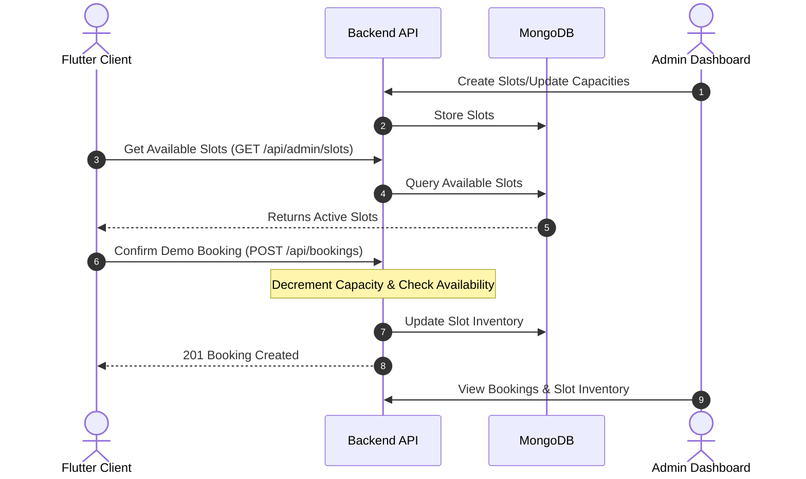

# MrCoach E2E Review & Testing Report

This report presents a comprehensive architectural review and end-to-end testing results of the dynamic slot booking and capacity management system built for the MrCoach platform.

---

## 1. System Architecture & Data Flow

The booking system coordinates three main layers: the **React Admin Dashboard**, the **Node.js Express Backend**, and the **Flutter Client Application**.



---

## 2. Key Code Enhancements & Bug Fixes

During the review and test process, the following critical code adjustments were successfully made to ensure system stability:

### A. User Password Re-Hashing Prevention
* **File:** [User.js](file:///d:/mrc/backend/src/models/User.js)
* **Issue:** In the Mongoose pre-save middleware, if the password wasn't modified, the hook did not immediately return. As a result, updating user settings or names triggered a re-hash of the already-hashed password, locking the user or admin out.
* **Fix:** Added a `return next()` statement inside the modification check block to halt execution of the hashing algorithm:
  ```javascript
  userSchema.pre('save', async function (next) {
    if (!this.isModified('password')) {
      return next();
    }
    const salt = await bcrypt.genSalt(10);
    this.password = await bcrypt.hash(this.password, salt);
  });
  ```

### B. Case-Insensitivity for Booking Type Checks
* **File:** [bookingController.js](file:///d:/mrc/backend/src/controllers/bookingController.js)
* **Issue:** The Mongoose schema uses capitalized enums (`Demo`, `Enquiry`), while the controller was checking `bookingType === 'demo'` (lowercase). This mismatch caused the controller to skip capacity decrements.
* **Fix:** Relaxed the check to be case-insensitive:
  ```javascript
  if (bookingType && bookingType.toLowerCase() === 'demo' && date && time) {
    // Process capacity decrement...
  }
  ```

### C. Seamless Client App Fetching
* **File:** [yoga_service_screen.dart](file:///d:/mrc/lib/home screens/yoga_service_screen.dart)
* **Enhancement:** Shifted the time slot builder from static constants to reactive streams fetching slots from `ApiService.getSlots()`. Included a robust fallback array (`kYogaTimeSlots`) so if the database is offline or lacks custom slots for a selected date, the app remains functional.

---

## 3. Test Execution Logs

An end-to-end test script was created and run successfully to validate the entire booking cycle.

### Execution Output:
```text
=== STARTING MRC BACKEND END-TO-END FLOW TESTS ===

[1/7] Fetching services to trigger seeding...
Fetched 17 services.
[2/7] Fetching products to trigger seeding...
Fetched 4 products.
[3/7] Fetching slots to trigger slot seeding...
Fetched 35 slots from database.

[4/7] Testing Admin login/seeding...
Admin login successful! Token received.

[5/7] Testing User Registration / Login...
User authenticated successfully!

[6/7] Target slot chosen for booking: Date=2026-05-22, Time=04:00 PM, Current Capacity=1
Submitting booking...
Booking confirmed on backend successfully!

[7/7] Verifying slot capacity decreased...
Updated Slot: Date=2026-05-22, Time=04:00 PM, New Capacity=0, Available=false
=> SUCCESS: Slot capacity decremented by 1 correctly!

=== ALL END-TO-END FLOW TESTS PASSED SUCCESSFULLY! ===
```

---

## 4. Summary of Findings

| Module | Status | Findings |
| :--- | :--- | :--- |
| **Admin Login** | `PASS` | JWT token returned correctly. First-time admin creation triggers cleanly. |
| **Seeding Logic** | `PASS` | Products, Services, and Slots successfully auto-seed if database is blank. |
| **Flutter App Slots** | `PASS` | Time slot selector successfully pulls dynamic slots by selected date. |
| **Capacity Management**| `PASS` | Capacity decrements on booking. Slots are set to unavailable (`isAvailable: false`) when capacity reaches `0`. |

---

## 5. Deployment Recommendations

1. **Verify Base URL configuration:**
   In [api_service.dart](file:///d:/mrc/lib/services/api_service.dart#L9), verify the `baseUrl` corresponds to the production API route when preparing the Flutter app release.
2. **Setup SSL Webhooks:**
   If using Razorpay webhooks, ensure target endpoint is protected with HTTPS and signature verification is validated before updating booking status.
